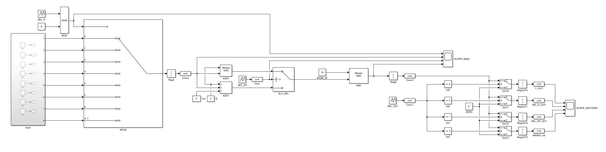
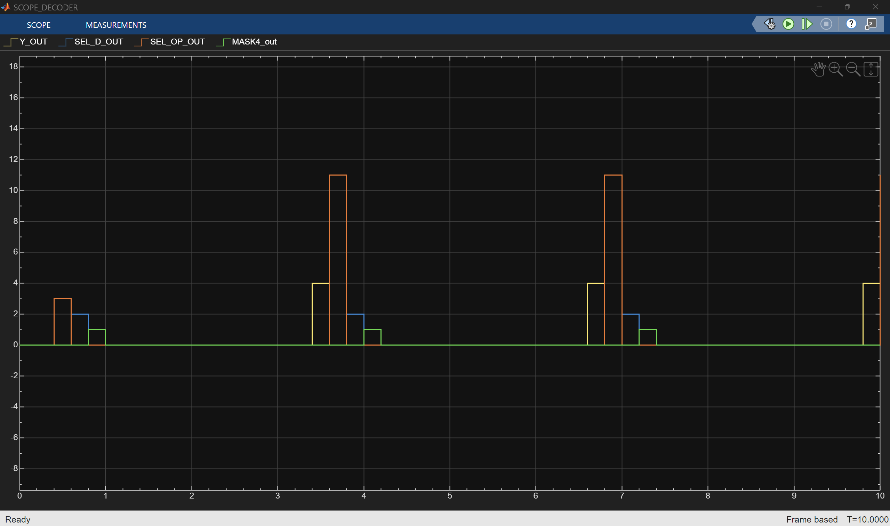

A simplified digital processor datapath in Simulink (not just pure combinational logic but a small synchronous, clocked system). First, during the fetch stage one of several input values will be chosen using an 8-to-1 multiplexer controlled by a selector signal (SEL_D). That selected value will be stored in a register (RegA), introducing clocked behavior. Next, a basic ALU that could perform either addition with a constant (+3) or a bitwise XOR with 3, controlled by another selector (SEL_OP). The ALU result is stored in a second register (RegY), separating execution from the previous stage. Then applied a 4-bit mask (AND with 15) to constrain the result to a defined bit width, which mimics limited hardware word size. After that, there is an output routing stage using a 1-of-4 decoder (comparisons like ==0, ==1, etc....) and switch blocks to direct the result into one of four output registers depending on SEL_OUT. Finally, there are registers after the routing stage so the whole system became fully synchronous, operating in discrete clock cycles with clear stage separation: Fetch → Execute → Mask → Writeback. This can be seen as a minimal pipelined processor-like datapath with operation selection, controlled data movement, bit-width handling, and addressed register writeback.

Processor Model

Output Signals

The output shows the time staggered behavior of the synchronous datapath:
first an input is selected (SEL_D_OUT), then the ALU operation is chosen (SEL_OP_OUT), producing Y_OUT, which is subsequently limited to 4 bits (MASK4_out), and finally written into the selected output register. The separated pulses reflect the pipeline delays introduced by the registers, meaning each stage completes in a different clock cycle rather than all at once.
